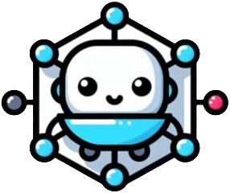
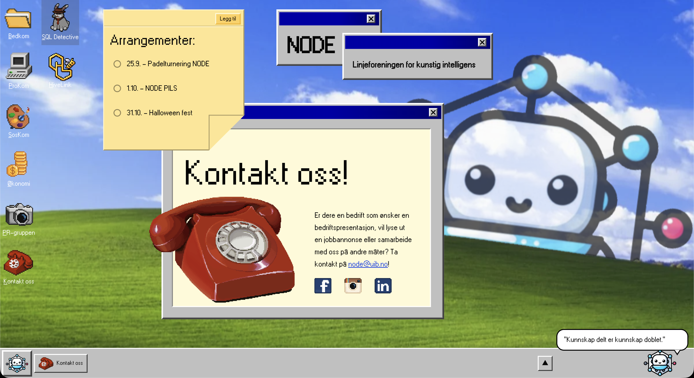
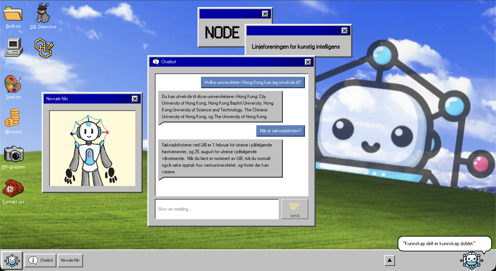
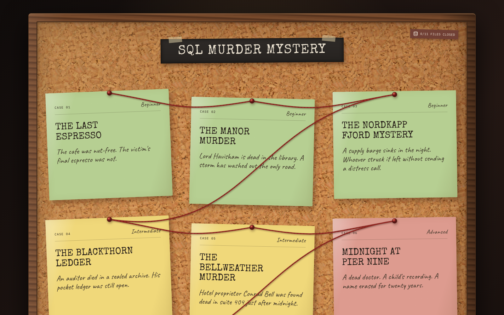

# NODE — Nettside

**Linjeforeningen for Kunstig Intelligens ved Universitetet i Bergen**

En nettside bygget som et nostalgisk Windows 95-skrivebord — komplett med ikoner, vinduer og en AI-chatbot som bor på skrivebordet ditt.

🔗 **Live på [node.uib.no](https://node.uib.no)**

 

 

## 💬 Møt Chatboten

Klikk på chatbot-ikonet i startmenyen, og få svar på alt fra utveksling til mastermuligheter.

 

## 🎲 Lei av å lese pensum? Spill heller litt!

Prøv deg som detektiv i vår SQL Murder Mystery på [sqlmm.node.uib.no](https://sqlmm.node.uib.no) — løs saker med SQL-spørringer mot en ekte database — eller samle honning for dronningbien i Hivelink på [hivelink.buzz](https://hivelink.buzz).

 

## 🛠️ Tech Stack

| | |
|---|---|
| **Framework** | [Next.js](https://nextjs.org/) 15 |
| **UI** | [React](https://react.dev/) |
| **Språk** | [TypeScript](https://www.typescriptlang.org/) |
| **Styling** | [Tailwind CSS](https://tailwindcss.com/) |

 

## 🙏 Takk til nettsidegruppa

Æren for denne nettsiden går til nettsidegruppa:

### ⭐ Amy
*Har lagt ned en enorm innsats og fortjener all mulig kred for denne siden.*

Magnus, Sondre, Håvard, Linnea, Sigrid, Karoline & Mahan
